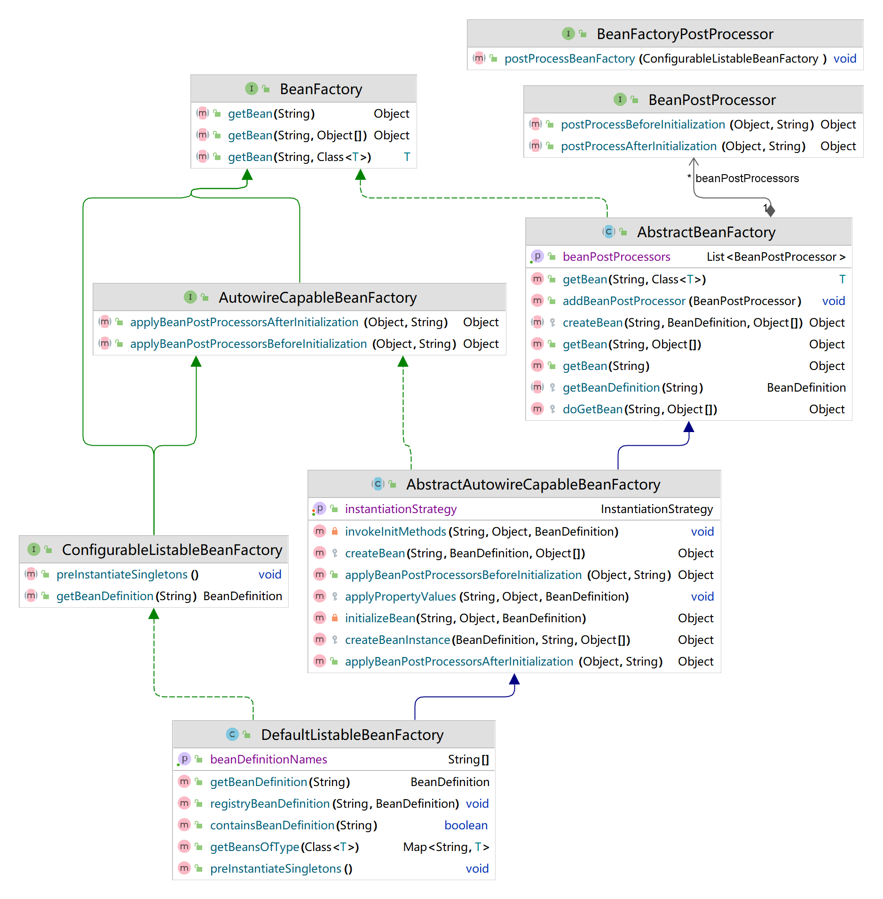

# 五、应用文上下文

> ApplicationContext由BeanFactory派生而来；BeanFactory的许多功能需要编程实现，而在ApplicationContext中则可以通过配置的方式实现；
## 5.1 上下文核心


### 上下文接口定义
```java
import cn.meshed.framework.beans.factory.ListableBeanFactory;

/**
 * <h1>应用上下文</h1>
 *
 * @author Vincent Vic
 * @version 1.0
 */
public interface ApplicationContext extends ListableBeanFactory {
}
```

```java
import cn.meshed.framework.beans.BeansException;

/**
 * <h1>配置应用上下文</h1>
 *
 * @author Vincent Vic
 * @version 1.0
 */
public interface ConfigurableApplicationContext extends ApplicationContext{

    /**
     * 刷新容器
     *
     * @throws BeansException
     */
    void refresh() throws BeansException;
}
```

### 上下文实现
AbstractApplicationContext继承ConfigurableApplicationContext主要核心方法refresh
- 1.创建 BeanFactory，并加载 BeanDefinition
- 2.获取 BeanFactory
- 3.在 Bean 实例化之前，执行 BeanFactoryPostProcessor (Invoke factory processors registered as beans in the context.)
- 4.BeanPostProcessor 需要提前于其他 Bean 对象实例化之前执行注册操作
- 5.提前实例化单例Bean对象

```java
import cn.meshed.framework.beans.BeansException;
import cn.meshed.framework.beans.factory.ConfigurableListableBeanFactory;
import cn.meshed.framework.beans.factory.config.BeanFactoryPostProcessor;
import cn.meshed.framework.beans.factory.config.BeanPostProcessor;
import cn.meshed.framework.context.ConfigurableApplicationContext;
import cn.meshed.framework.core.io.DefaultResourceLoader;

import java.util.Map;

/**
 * <h1>抽象应用上下文</h1>
 *
 * @author Vincent Vic
 * @version 1.0
 */
public abstract class AbstractApplicationContext extends DefaultResourceLoader implements ConfigurableApplicationContext {

    /**
     * 刷新Bean工厂
     *
     * @throws BeansException
     */
    protected abstract void refreshBeanFactory() throws BeansException;

    /**
     * 得到Bean工厂
     *
     * @return {@link ConfigurableListableBeanFactory}
     */
    protected abstract ConfigurableListableBeanFactory getBeanFactory();

    /**
     * 获取bean
     *
     * @param beanName
     * @return Object
     * @throws BeansException
     */
    @Override
    public Object getBean(String beanName) throws BeansException {
        return getBeanFactory().getBean(beanName);
    }

    /**
     * 获取bean
     *
     * @param beanName
     * @param args
     * @return Object
     * @throws BeansException
     */
    @Override
    public Object getBean(String beanName, Object... args) throws BeansException {
        return getBeanFactory().getBean(beanName, args);
    }

    /**
     * 如果保护懒加载的类,FactoryBean初始化的类和工厂方法初始化的类会被初始化.就是说执行这个方法会执行对应的初始化.
     * 根据类型（包括子类）返回指定Bean名和Bean的Map
     *
     * @param type 类型
     * @return
     * @throws BeansException
     */
    @Override
    public <T> Map<String, T> getBeansOfType(Class<T> type) throws BeansException {
        return getBeanFactory().getBeansOfType(type);
    }

    /**
     * 返回工厂中所有Bean的名字
     *
     * @return {@link String[]}
     */
    @Override
    public String[] getBeanDefinitionNames() {
        return getBeanFactory().getBeanDefinitionNames();
    }

    /**
     * 根据需要类型获取bean
     *
     * @param beanName     Bean名称
     * @param requiredType 指定类型
     * @param <T>
     * @return {@link T}
     * @throws BeansException
     */
    @Override
    public <T> T getBean(String beanName, Class<T> requiredType) throws BeansException {
        return getBeanFactory().getBean(beanName, requiredType);
    }


    /**
     * 刷新容器
     *
     * @throws BeansException
     */
    @Override
    public void refresh() throws BeansException {
        // 1.创建BeanFactory,并加载Bean定义
        refreshBeanFactory();

        // 2.获取BeanFactory
        ConfigurableListableBeanFactory beanFactory = getBeanFactory();

        // 3.在Bean实例化之前，执行BeanFactoryPostProcessor(Invoke factory processors registered as beans in the context.)
        invokeBeanFactoryPostProcessors(beanFactory);

        // 4.BeanPostFactory需要提前Bean对象实例化之前执行注册操作
        registerBeanPostProcessors(beanFactory);

        // 5.提前实例化单例Bean对象
        beanFactory.preInstantiateSingletons();
    }


    /**
     * 执行BeanFactoryPostProcessor
     *
     * @param beanFactory Bean工厂
     */
    private void invokeBeanFactoryPostProcessors(ConfigurableListableBeanFactory beanFactory) {
        Map<String, BeanFactoryPostProcessor> beanFactoryPostProcessorMap = beanFactory.getBeansOfType(BeanFactoryPostProcessor.class);
        if (beanFactoryPostProcessorMap == null || beanFactoryPostProcessorMap.size() == 0){
            return;
        }
        beanFactoryPostProcessorMap.values()
                .forEach(beanFactoryPostProcessor -> beanFactoryPostProcessor.postProcessBeanFactory(beanFactory));
    }

    /**
     * BeanPostFactory 注册操作
     *
     * @param beanFactory Bean工厂
     */
    private void registerBeanPostProcessors(ConfigurableListableBeanFactory beanFactory) {
        Map<String, BeanPostProcessor> beanPostProcessorMap = beanFactory.getBeansOfType(BeanPostProcessor.class);
        if (beanPostProcessorMap == null || beanPostProcessorMap.size() == 0){
            return;
        }
        beanPostProcessorMap.values().forEach(beanFactory::addBeanPostProcessor);
    }
}
```
AbstractRefreshableApplicationContext实现AbstractApplicationContext定义的接口，创建 BeanFactory，并加载 BeanDefinition
```java
import cn.meshed.framework.beans.BeansException;
import cn.meshed.framework.beans.factory.ConfigurableListableBeanFactory;
import cn.meshed.framework.beans.factory.support.DefaultListableBeanFactory;

/**
 * <h1>刷新应用上下文</h1>
 *
 * @author Vincent Vic
 * @version 1.0
 */
public abstract class AbstractRefreshableApplicationContext extends AbstractApplicationContext {

    private DefaultListableBeanFactory beanFactory;


    /**
     * 加载Bean 定义
     * @param beanFactory Bean 工厂
     */
    protected abstract void loadBeanDefinitions(DefaultListableBeanFactory beanFactory);

    /**
     * 刷新Bean工厂
     *
     * @throws BeansException
     */
    @Override
    protected void refreshBeanFactory() throws BeansException {
        DefaultListableBeanFactory beanFactory = createBeanFactory();
        loadBeanDefinitions(beanFactory);
        this.beanFactory = beanFactory;
    }

    /**
     * 得到Bean工厂
     *
     * @return {@link ConfigurableListableBeanFactory}
     */
    @Override
    protected ConfigurableListableBeanFactory getBeanFactory() {
        return beanFactory;
    }

    private DefaultListableBeanFactory createBeanFactory(){
        return new DefaultListableBeanFactory();
    }
}
```
AbstractXmlApplicationContext实现AbstractRefreshableApplicationContext提供XML加载Bean定义信息的实际业务，其配置位置交给下次具体实现类
```java
import cn.meshed.framework.beans.factory.support.DefaultListableBeanFactory;
import cn.meshed.framework.beans.factory.xml.XmlBeanDefinitionReader;

/**
 * <h1>XML 文件应用上下文</h1>
 *
 * @author Vincent Vic
 * @version 1.0
 */
public abstract class AbstractXmlApplicationContext extends AbstractRefreshableApplicationContext{

    /**
     * 加载配置位置
     *
     * @return {@link String[]}
     */
    protected abstract String[] getConfigLocations();

    /**
     * 加载Bean 定义
     *
     * @param beanFactory Bean 工厂
     */
    @Override
    protected void loadBeanDefinitions(DefaultListableBeanFactory beanFactory) {
        XmlBeanDefinitionReader beanDefinitionReader = new XmlBeanDefinitionReader(beanFactory);
        String[] configLocations = getConfigLocations();
        if (null != configLocations){
            beanDefinitionReader.loadBeanDefinitions(configLocations);
        }
    }
}

```
ClassPathXmlApplicationContext为抽象类提供xml位置的配置，调用父类的刷新完成自动加载的功能
```java
/**
 * <h1>XML 文件应用上下文</h1>
 *
 * @author Vincent Vic
 * @version 1.0
 */
public class ClassPathXmlApplicationContext extends AbstractXmlApplicationContext{

    private String[] configLocations;

    public ClassPathXmlApplicationContext() {
    }

    public ClassPathXmlApplicationContext(String configLocation) {
        this(new String[]{configLocation});
    }

    public ClassPathXmlApplicationContext(String[] configLocations) {
        this.configLocations = configLocations;
        refresh();
    }

    /**
     * 加载配置位置
     *
     * @return {@link String[]}
     */
    @Override
    protected String[] getConfigLocations() {
        return configLocations;
    }

}
```

## 5.2 Bean和BeanFactory扩展


BeanFactory添加根据需要类型获取bean方法
```java
import cn.meshed.framework.beans.BeansException;
public interface BeanFactory {

    //...

    /**
     * 根据需要类型获取bean
     *
     * @param beanName Bean名称
     * @param requiredType 指定类型
     * @return {@link T}
     * @param <T>
     * @throws BeansException
     */
    <T> T getBean(String beanName, Class<T> requiredType) throws BeansException;
}
```
ConfigurableListableBeanFactory添加预先初始化Bean方法定义
```java
import cn.meshed.framework.beans.BeansException;
public interface ConfigurableListableBeanFactory extends ConfigurableBeanFactory, ListableBeanFactory,
        AutowireCapableBeanFactory {

    //...

    /**
     * 预先初始化Bean
     *
     * @throws BeansException
     */
    void preInstantiateSingletons() throws BeansException;

}
```
AutowireCapableBeanFactory添加对BeanPostProcessors的前置和后置处理的方法定义
```java
import cn.meshed.framework.beans.BeansException;
import cn.meshed.framework.beans.factory.BeanFactory;
public interface AutowireCapableBeanFactory extends BeanFactory {

    /**
     * 执行 BeanPostProcessors 接口实现类的 postProcessBeforeInitialization 方法
     *
     * @param existingBean 扩展Bean
     * @param beanName Bean名称
     * @return {@link Object}
     * @throws BeansException
     */
    Object applyBeanPostProcessorsBeforeInitialization(Object existingBean, String beanName) throws BeansException;

    /**
     * 执行 BeanPostProcessors 接口实现类的 postProcessorsAfterInitialization 方法
     *
     * @param existingBean 扩展Bean
     * @param beanName Bean名称
     * @return {@link Object}
     * @throws BeansException
     */
    Object applyBeanPostProcessorsAfterInitialization(Object existingBean, String beanName) throws BeansException;
}

```
BeanFactoryPostProcessor允许自定义修改 BeanDefinition 属性信息
```java
import cn.meshed.framework.beans.BeansException;
import cn.meshed.framework.beans.factory.ConfigurableListableBeanFactory;

/**
 * <h1>允许自定义修改 BeanDefinition 属性信息</h1>
 *
 * @author Vincent Vic
 * @version 1.0
 */
public interface BeanFactoryPostProcessor {

    /**
     * 在所有的 BeanDefinition 加载完成后，实例化 Bean 对象之前，提供修改 BeanDefinition 属性的机制
     *
     * @param beanFactory Bean工厂
     * @throws BeansException
     */
    void postProcessBeanFactory(ConfigurableListableBeanFactory beanFactory) throws BeansException;
}
```
BeanPostProcessor添加Bean 对象的扩展点接口
```java
import cn.meshed.framework.beans.BeansException;

/**
 * <h1>用于修改新实例化 Bean 对象的扩展点</h1>
 *
 * @author Vincent Vic
 * @version 1.0
 */
public interface BeanPostProcessor {

    /**
     * 在 Bean 对象执行初始化方法之前，执行此方法
     *
     * @param bean bean对象
     * @param beanName bean名称
     * @return {@link Object}
     * @throws BeansException
     */
    Object postProcessBeforeInitialization(Object bean, String beanName) throws BeansException;

    /**
     * 在 Bean 对象执行初始化方法之后，执行此方法
     *
     * @param bean bean对象
     * @param beanName bean名称
     * @return {@link Object}
     * @throws BeansException
     */
    Object postProcessAfterInitialization(Object bean, String beanName) throws BeansException;
}
```
ConfigurableBeanFactory添加Bean扩展处理器定义
```java
import cn.meshed.framework.beans.factory.HierarchicalBeanFactory;
public interface ConfigurableBeanFactory extends HierarchicalBeanFactory {

    //...

    /**
     * 添加Bean扩展处理器
     * @param beanPostProcessor
     */
    void addBeanPostProcessor(BeanPostProcessor beanPostProcessor);
}

```
替换BeanFactory为ConfigurableBeanFactory，提供对BeanPostProcessor的创建及管理
```java
import cn.meshed.framework.beans.BeansException;
import cn.meshed.framework.beans.factory.config.BeanPostProcessor;
import cn.meshed.framework.beans.factory.config.ConfigurableBeanFactory;
import java.util.ArrayList;
import java.util.List;

public abstract class AbstractBeanFactory extends DefaultSingletonBeanFactory implements ConfigurableBeanFactory {

    /**
     * BeanPostProcessors to apply in createBean
     */
    private final List<BeanPostProcessor> beanPostProcessors = new ArrayList<>();
    
    //...
    
    /**
     * 根据需要类型获取bean
     *
     * @param beanName     Bean名称
     * @param requiredType 指定类型
     * @return {@link T}
     * @throws BeansException
     */
    @Override
    public <T> T getBean(String beanName, Class<T> requiredType) throws BeansException {
        return (T) getBean(beanName);
    }

    /**
     * 添加Bean扩展处理器
     *
     * @param beanPostProcessor
     */
    @Override
    public void addBeanPostProcessor(BeanPostProcessor beanPostProcessor) {
        this.beanPostProcessors.remove(beanPostProcessor);
        this.beanPostProcessors.add(beanPostProcessor);
    }

    /**
     * 返回BeanPostProcessor列表
     *
     * @return {@link BeanPostProcessor}
     */
    public List<BeanPostProcessor> getBeanPostProcessors() {
        return beanPostProcessors;
    }

    //...
}

```
添加继承AutowireCapableBeanFactory，实现对BeanPostProcessors前置处理和后置处理的操作，创建bean过程中加入initializeBean实现，前置处理和后置处理分别在初始化方法前后
```java
import cn.meshed.framework.beans.BeansException;
import cn.meshed.framework.beans.factory.config.AutowireCapableBeanFactory;
import cn.meshed.framework.beans.factory.config.BeanDefinition;
import cn.meshed.framework.beans.factory.config.BeanPostProcessor;
public abstract class AbstractAutowireCapableBeanFactory extends AbstractBeanFactory implements AutowireCapableBeanFactory {

    //...
    
    /**
     * 创建Bean定义
     *
     * @param beanName
     * @param beanDefinition
     * @return
     */
    @Override
    protected Object createBean(String beanName, BeanDefinition beanDefinition, Object[] args) throws BeansException {
        Object bean = null;
        try {
            bean = createBeanInstance(beanDefinition, beanName, args);
            //填充属性
            applyPropertyValues(beanName, bean, beanDefinition);
            // 执行 Bean 的初始化方法和 BeanPostProcessor 的前置和后置处理方法
            bean = initializeBean(beanName, bean, beanDefinition);
        } catch (Exception e) {
            throw new BeansException("Instantiation of bean failed", e);
        }
        registerSingleton(beanName, bean);
        return bean;
    }

    //...

    private Object initializeBean(String beanName,Object bean,BeanDefinition beanDefinition){
        // 1. 执行 BeanPostProcessor Before 处理
        Object wrappedBean = applyBeanPostProcessorsBeforeInitialization(bean, beanName);

        // 2.调用初始化方法
        invokeInitMethods(beanName,wrappedBean,beanDefinition);

        // 3. 执行 BeanPostProcessor After 处理
        wrappedBean = applyBeanPostProcessorsAfterInitialization(bean, beanName);
        return wrappedBean;
    }

    /**
     * 调用初始化方法 待实现
     *
     * @param beanName bean 名称
     * @param wrappedBean 包装bean对象
     * @param beanDefinition bean定义
     */
    private void invokeInitMethods(String beanName, Object wrappedBean, BeanDefinition beanDefinition) {

    }

    /**
     * 执行 BeanPostProcessors 接口实现类的 postProcessBeforeInitialization 方法
     *
     * @param existingBean 扩展Bean
     * @param beanName     Bean名称
     * @return {@link Object}
     * @throws BeansException
     */
    @Override
    public Object applyBeanPostProcessorsBeforeInitialization(Object existingBean, String beanName) throws BeansException {
        Object result = existingBean;
        for (BeanPostProcessor processor : getBeanPostProcessors()) {
            Object current = processor.postProcessBeforeInitialization(result, beanName);
            if (null == current) {
                return result;
            }
            result = current;
        }
        return result;
    }

    /**
     * 执行 BeanPostProcessors 接口实现类的 postProcessorsAfterInitialization 方法
     *
     * @param existingBean 扩展Bean
     * @param beanName     Bean名称
     * @return {@link Object}
     * @throws BeansException
     */
    @Override
    public Object applyBeanPostProcessorsAfterInitialization(Object existingBean, String beanName) throws BeansException {
        Object result = existingBean;
        for (BeanPostProcessor processor : getBeanPostProcessors()) {
            Object current = processor.postProcessAfterInitialization(result, beanName);
            if (null == current) {
                return result;
            }
            result = current;
        }
        return result;
    }
}

```
BeanDefinitionReader添加多个位置的加载
```java
import cn.meshed.framework.beans.BeansException;
public interface BeanDefinitionReader {

    //...

    /**
     * 根据多个位置加载Bean定义
     * @param locations 位置
     * @throws BeansException bean 加载异常
     */
    void loadBeanDefinitions(String ...locations) throws BeansException;

}

```
DefaultListableBeanFactory实现预先创建单例Bean
```java
import cn.meshed.framework.beans.BeansException;
public class DefaultListableBeanFactory extends AbstractAutowireCapableBeanFactory implements BeanDefinitionRegistry, ConfigurableListableBeanFactory {

    //...

    /**
     * 预先初始化Bean
     *
     * @throws BeansException
     */
    @Override
    public void preInstantiateSingletons() throws BeansException {
        beanDefinitionMap.keySet().forEach(this::getBean);
    }


    //...
}

```
XmlBeanDefinitionReader添加根据多个位置加载Bean定义
```java
import cn.meshed.framework.beans.BeansException;

public class XmlBeanDefinitionReader extends AbstractBeanDefinitionReader {

    //...
    
    /**
     * 根据多个位置加载Bean定义
     *
     * @param locations 位置
     * @throws BeansException bean 加载异常
     */
    @Override
    public void loadBeanDefinitions(String... locations) throws BeansException {
        for (String location : locations) {
            loadBeanDefinitions(location);
        }
    }
}

```


## 5.3 测试

BeanFactoryPostProcessor测试类型 仅打印信息
```java
package cn.meshed.framework.test.context;

import cn.meshed.framework.beans.BeansException;
import cn.meshed.framework.beans.factory.ConfigurableListableBeanFactory;
import cn.meshed.framework.beans.factory.config.BeanFactoryPostProcessor;

/**
 * <h1></h1>
 *
 * @author Vincent Vic
 * @version 1.0
 */
public class PrintBeanFactoryPostProcessor implements BeanFactoryPostProcessor {
    /**
     * 在所有的 BeanDefinition 加载完成后，实例化 Bean 对象之前，提供修改 BeanDefinition 属性的机制
     *
     * @param beanFactory Bean工厂
     * @throws BeansException
     */
    @Override
    public void postProcessBeanFactory(ConfigurableListableBeanFactory beanFactory) throws BeansException {
        System.out.println("Post Process Bean Factory ： Print");
    }
}

```
BeanPostProcessor测试类型 仅打印信息
```java
package cn.meshed.framework.test.context;

import cn.meshed.framework.beans.BeansException;
import cn.meshed.framework.beans.factory.config.BeanPostProcessor;

/**
 * <h1></h1>
 *
 * @author Vincent Vic
 * @version 1.0
 */
public class PrintBeanPostProcessor implements BeanPostProcessor {
    /**
     * 在 Bean 对象执行初始化方法之前，执行此方法
     *
     * @param bean     bean对象
     * @param beanName bean名称
     * @return {@link Object}
     * @throws BeansException
     */
    @Override
    public Object postProcessBeforeInitialization(Object bean, String beanName) throws BeansException {
        System.out.println("Post Process Before Initialization ： "+ beanName);
        return bean;
    }

    /**
     * 在 Bean 对象执行初始化方法之后，执行此方法
     *
     * @param bean     bean对象
     * @param beanName bean名称
     * @return {@link Object}
     * @throws BeansException
     */
    @Override
    public Object postProcessAfterInitialization(Object bean, String beanName) throws BeansException {
        System.out.println("Post Process After Initialization ： "+ beanName);
        return bean;
    }
}

```
上下文配置，主要新增PrintBeanPostProcessor和PrintBeanFactoryPostProcessor定义
```xml
<?xml version="1.0" encoding="UTF-8"?>
<beans>

    <bean id="userDao" class="cn.meshed.framework.test.context.UserDao"/>

    <bean id="userService" class="cn.meshed.framework.test.context.UserService">
        <property name="uid" value="001"/>
        <property name="userDao" ref="userDao"/>
    </bean>

    <bean class="cn.meshed.framework.test.context.PrintBeanPostProcessor"/>
    <bean class="cn.meshed.framework.test.context.PrintBeanFactoryPostProcessor"/>

</beans>
```
测试类型
```java
import cn.meshed.framework.context.ApplicationContext;
import cn.meshed.framework.context.support.ClassPathXmlApplicationContext;
import org.junit.Test;


/**
 * <h1></h1>
 *
 * @author Vincent Vic
 * @version 1.0
 */
public class ApiTest {

    @Test
    public void test_context() {
        ApplicationContext applicationContext = new ClassPathXmlApplicationContext("classpath:spring-context.xml");

        UserService userService = applicationContext.getBean("userService", UserService.class);
        String info = userService.queryUserInfo();
        System.out.println(info);
    }

}

```

## 5.4 总结
由于单一职责派生了较多实现类，将上一章节实现的内容进一步简化成跟贴近使用的框架，加入BeanPostProcessor和BeanFactoryPostProcessor两个Spirng比较关键的操作。

> 具体见代码仓库 [Tree 0.0.5](https://github.com/Vincent-Vic/spring-mini/tree/0.0.5)